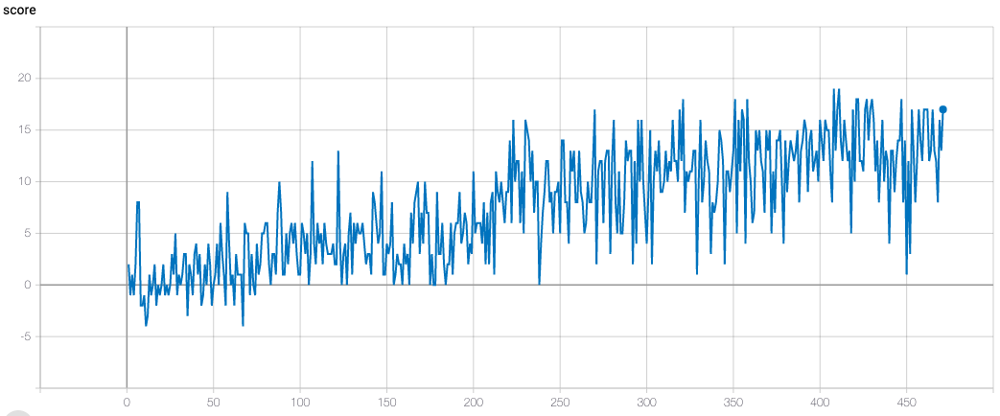

## Report

#### Learning Algorithm

I have choosen a Deep-Q-Network (DQN) to solve this environment. In a DQN, a neural net is used as an approximator-function for the values of the state-action pairs. Each of these values represent a reward, which will be reached if the corresponding action is choosen in a particular state. The goal of the task is to maximize the reward. The maximum reward can be reached, by choosing the actions with the maximum values. And these maximum values are reached by improving the approximator function to give the best action. As the approximator function is the neural net, an improvement can be reached by training this net using samples of states, the choosen actions and the corresponding reward and using gradient descent to adjust the weights of the network to better approximate these samples. The gradients in turn are calculated by backpropagating the result of a loss function. These loss function calculates the difference between the value of a sample action-state pair given of the actual neural net, and the value of the same sample feeded into another neural net. This other neural net, the target network, has the same architecture as the actual neural net. The target network is updated from time to time with the weights of the actual network. This is called fixed-target-network, a method to produce more stable results and let the actual network train better, by not influence itself too much as if used as input and as target value in a loss function. By training the neural net this way, the approximated values for a state-aciton pair get more precise, and by having precise possible values, the choice of the action with the highest value and therefore highest reward is ensured. Exploration and exploiting for choosing this actions is ensured by using an epsilon-greedy strategy by choosing either the proposed action from the neural net, or randomly some of the other actions.

#### Model

The model for the neural net consists of an input size of 37, which is the observation space from the environment. These inputs are forwarded through two fully-connected hidden layers, with 74 hidden nodes. The output layer maps these 74 nodes to 4, which is the action size. All layers except the output layer are activated by leaky relu.

This model architecture is used for the local and the target network.

#### Hyperparameter
**hidden_1_size**
Size of the first hidden layer, I have choosen the double of the input (37)

***hidden_2_size**
Size of the second hidden layer, I have choose the same size as the first hidden layer

**epsilon_start**
Configures the epsilon for the epsilon-greedy strategy at start of each episode. Actual value is `0.1`.

**epsilon_decay_rate**
Configures how much the epsilon should decay after each timestep, actual value `0.995`.

**epsilon_max_decay_to**
Configures a minimum value the epsilon should have, regardless the decay rate. Actual value `0.01``

**update_every**
Controls how often the weights of the target network should be updated, actual value `4`, which means every 4th timestep.

**buffer_size**
Configures the maximum size of the replay buffer, older values will be discarded, actual value `1_000_000`.

**sample_batch_size**
Configures how much samples at each learning step should be pulled from the replay buffer, actual value `64`

**gamma**
The factor how much future rewards should be noted in the valuation of the current action, acutal value `0.99`

**tau**
Configures the ratio of how much the target values in the target network should be updated with actual vlaues during update process, actual value `1e-3`

**learning_rate**
The learning rate of the optimizer, acutal value `5e-4`

#### Rewards

The agent reaches a mean reward of 13.02 over the last 100 episodes after episode 472.

#### Ideas for Future work

- Due to `DQN` tends to overestimate action values, using a `Double DQN` would improve this submission

- The use of a prioritized experience replay buffer, in which sampling focus lies on values with high error, could make the agent reach the goal faster. Due to the values have high error, there is a lot to learn from this values. Also sparse experiences have the chance to be sampled more often.