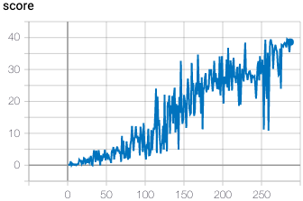

## Report

#### Learning Algorithm

I have choosen a DDPG [2] to solve this environment. The DDPG consists of a total of 4 neural networks, divided into Actor (local version and target version) and Critic (local version and target version). The Actor is able to predict the actions in continuous space. In this algorithm, the actor deterministically predicts one action, the action which maximizes the reward. This is not a stochastic output from which the action is choosen like in PPO. To enable exploration, a noise is added to every predicted action. The critic predicts the best Q-Value for a state, as in DQN, but with the speciality that the action is added to the observation input. Both of the target networks are copies from their local networks and not trained by backpropagation. Instead, their weights are updated with a very small portion of their related local weights every timestep.

#### Model

I use the DDPG architecture from the DDPG paper[2] section 7 `Experiment Details`.
The Actor gets the observation space as input, which is mapped to a dimension of `400` in the first hidden layer. The second hidden layer maps from size `400` to size `300` and the last layer maps to the action size. The last layer uses `tanh` as activation function.

The critic gets the observation space as input, which is mapped to size `400` in the first hidden layer. 
To the second hidden layer, the actions are added in the input and then mapped to a dimension of `300`. The last layer maps from size `300` to the output dimension of `1`, 

In both, the actor and the critic, the weights and bias of the last layer are initialized by a uniform distribution within `(-3*10e-3, 3*10e-3)`.

I have choosen `leaky relu` as activation function in the hidden layers in both, the actor and the critic.

This model architecture is used for the local and the target network.

#### Hyperparameter

**buffer_size**
Configures the maximum size of the replay buffer, older values will be discarded. I started with a size of `10e6`, like described in the DDPG paper. As this takes a while to fill with one agent, I decreased the buffer size to `1e6`, like used in the udacity example in [1].
This also took a while, therefore I decreased to `1e5`.

**sample_batch_size**
Configures how much samples at each learning step should be pulled from the replay buffer, actual value `64` identical to the size in the DDPG paper [2].

**gamma**
The factor how much future rewards should be noted in the valuation of the current action, actual value `0.99` like in the DDPG paper [2].

**tau**
Configures the ratio of how much the target weights in the target network should be updated with actual weights during update process, actual value `1e-3` like in the DDPG paper [2].

**actor_learning_rate**
The learning rate of the actors' optimizer, actual value `10e-4` like in the DDPG paper [2].

**critic_learning_rate**
The learning rate of the critic's optimizer, actual value `10e-3` like in the DDPG paper [2].

**update_every**
Controls how often the weights of the target network should be updated, actual value `10`, which means every 10th timestep.
#todo
1) As the notes to the `Benchmark Implementation` from the udacity project, the agent is unstable and after a while of training, performance crashed. Like in the benchmark udacity project mentioned, I also add
torch.nn.utils.clip_grad_norm_(self.critic_local.parameters(), 1)
performance drops again
2) As in the notes: update every x-timestep
Again, performance drops
3) change hyperparameter with tune, describe which hyperparameter and their ranges

#### Rewards

The agent reaches a mean reward of #todo over the last 100 episodes after episode #todo.

#### Ideas for Future work

- First of all, maybe switch to multiple agents like described in version 2 of this project could speed-up training due to getting experience in parallel and therefore a larger replay buffer is possible.

- In the notes to the `Benchmark Implementation` from the udacity project, several other algorithms like TRPO, TNPG or D4PG are mentioned to be more stable and to achieve better performance in this project.

- The use of a prioritized experience replay buffer, in which sampling focus lies on values with high error, could make the agent reach the goal faster. Due to the values have high error, there is a lot to learn from this values. Also sparse experiences have the chance to be sampled more often.

- As a K-80 GPU has a load of ~35%, and a V-100 GPU has a load of ~12%, maybe GPU-Usage can be improved by trying to shift more operations to the GPU. On the other hand, the models are small and it looks like a K-80 is enough.

[1] https://github.com/udacity/deep-reinforcement-learning/tree/master/ddpg-bipedal

[2] https://arxiv.org/abs/1509.02971