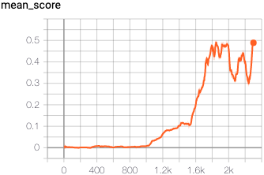

## Report

#### Learning Algorithm

- in my learn: actor: I did actor_local(all_states) for ALL agents and summed the result up: correct: only for the agent in the loop
--- das ist jetzt auch noch falsch in actor_target?!
- AND not (all_states), but for every single state one call, array result up

I have choosen a MADDPG[2] to solve this environment. In this project, the MADDPG consists of 2 agents and a total of 4 neural networks per agent, divided into Actor (local version and target version) and Critic (local version and target version). Each agent's actor is able to predict the actions in continuous space. In this algorithm, the actor deterministically predicts one action, the action which maximizes the reward for the agent. For every of the 2 agents, the next actions are predicted separately and added into a list. Every of the 2 agent's critic gets this list (the list is caluclated new for every critic) as input to get the Q-value. This calculation is done for every local and target critic of both agents. The critic's loss is calculated with the local and target Q-value. This is done for each agent separately.
For every agent, the actor's loss is calculated separately, too. For the actor's loss, the next actions for the local actor are predicted and used within the agent's local critic to estimate a reward. This estimated reward represents the loss, which then can be optimized by gradient descent. As gradient descent decreases the loss, the estimated reward is prefixed with a negative sign, to use gradient descent as gradient ascent. To enable exploration, a noise is added to every predicted action for every agent. All of the target networks are copies from their local networks and not trained by backpropagation. Instead, their weights are updated with a very small portion of their related local weights every timestep. All agents share one replay buffer.

I have choosen to update target network directly while iterating over agents and update their local networks, due to code-reuse from DDPG implementation of previous project 2 `Continous Control`. Here my implementation differs from MADDPG[2], which does this in a separate step after the for-loop.

#### Model

I use the DDPG architecture from the DDPG paper[2] section 7 `Experiment Details`. The vector observation space size is 8, with a number of 3 stacked vector observations, a total input size of 24.
The Actor gets the observation space as input, which is mapped to a dimension of `200` in the first hidden layer. The second hidden layer maps from size `200` to size `150` and the last layer maps to the action size. Udacity Honor Code: I copied this values from a solution for this project from [9].

The last layer uses `tanh` as activation function.

The critic gets the observation space and actions as input, which are added before the first hidden layer and then mapped to size `200` in the first hidden layer. To the second hidden layer has a dimension of `150`. 
Udacity Honor Code: I first added the actions to the first hidden layer. After having a look into a solution for this project in [8], I added the actions to the inputs before the first hidden layer. I also copied the layer sizes `200` and `150` from a solution for this project from [8].

The last layer maps from size `300` to the output dimension of `1`, 

In both, the actor and the critic, the weights and bias of the last layer are initialized by a uniform distribution within `(-3e-3, 3e-3)`. Udacity Honor Code: I set this values to `(-3e-3, 3e-3)` as I had a look into a solution for this project in [9].

Udacity Honor Code: I first have choosen `leaky relu` as activation function in the hidden layers in both, the actor and the critic. After having a look into a solution for this project in [9], I changed it to `relu`.

This model architecture is used for the local and the target network.

#### Hyperparameter

**buffer_size**
Controls the buffer size of the replay buffer, actual value 1e5. Udacity Honor Code: I copied this value from a solution for this project from [8].

**sample_batch_size**
Configures how much samples at each learning step should be pulled from the replay buffer, actual value 250. Udacity Honor Code: I copied this value from a solution for this project from [8].

**gamma**
The factor how much future rewards should be noted in the valuation of the current action, actual value `0.99`. Udacity Honor Code: I copied this value from a solution for this project from [8].

**tau**
Configures the ratio of how much the target weights in the target network should be updated with actual weights during update process, actual value `1e-3`. Udacity Honor Code: I copied this value from a solution for this project from [8].

**actor_learning_rate**
The learning rate of the actors' optimizer, actual value `1e-4`. Udacity Honor Code: I copied this value from a solution for this project from [8].

**critic_learning_rate**
The learning rate of the critic's optimizer, actual value `1e-3`. Udacity Honor Code: I copied this value from a solution for this project from [8].

**update_every**
Controls how often the weights of the target network should be updated, actual value `1`, which means every timestep. Udacity Honor Code: I copied this value from a solution for this project from [8].

**weight_decay for critic optimizer**
Udacity Honor Code: I set this value to zero as I had a look into a solution for this project in [8].

**noise**
In the DDPG paper[2] to enable exploration, a noise generated with an Ornstein-Uhlenbeck process is added to the selected action. The Noise is configured with θ = 0.15 and σ = 0.2. Udacity Honor Code: I copied this values from a solution for this project from [8].

**epsilon**
Udacity Honor Code: I removed this value as I had a look into a solution for this project in [8], noise decay is not necessary.

**init_weights_variance**
Controls the initial uniform weight variance of the last layer of actor and critic. Actual value (-3e-3, 3e-3). Udacity Honor Code: I copied this value from a solution for this project from [8].

**hidden_layer_1**
The layer size of the first hidden layer of actor and critic. Actual value 200. Udacity Honor Code: I copied this value from a solution for this project from [8].

**hidden_layer_2**
The layer size of the second hidden layer of actor and critic. Actual value 150. Udacity Honor Code: I copied this value from a solution for this project from [8].

**sigma**
Controls the sigma of the Ohrnstein-Uhlenbeck noise. Actual value 0.2. Udacity Honor Code: I copied this value from a solution for this project from [8].

**theta**
Controls the theta of the Ohrnstein-Uhlenbeck noise. Actual value 0.15. Udacity Honor Code: I copied this value from a solution for this project from [8].

#### Rewards

The agent reaches a mean reward of 0.5 over the last 100 episodes after episode 2302.

#### Ideas for Future work

- First of all, maybe switch to multiple agents like used in the MADDPG-Lab-Implementation from Udacity could speed-up training due to getting experience in parallel and therefore chances are to have more experiences in the buffer which contain reward > 0 made by multiple agents through exploration in early stage of training. Learning from samples with positive reward is good as reward should be maximized.

- In the notes to the `Benchmark Implementation` from the udacity project, a solution which uses self-play is used. This can alternatively implemented to solve this task.

- The use of a prioritized experience replay buffer, in which sampling focus lies on values with high error, could make the agent reach the goal faster. Due to the values have high error, there is a lot to learn from this values. Also sparse experiences have the chance to be sampled more often.

- In the MADDPG-paper, a huber loss is used. As described in [7], this is more robust to outliers and could improve training here.

[1] https://github.com/udacity/deep-reinforcement-learning/tree/master/ddpg-bipedal

[2] https://arxiv.org/abs/1706.02275

[3] https://github.com/udacity/deep-reinforcement-learning/blob/master/ddpg-bipedal/ddpg_agent.py#L18

[4] https://knowledge.udacity.com/questions/277763

[7] https://pytorch.org/docs/stable/generated/torch.nn.SmoothL1Loss.html

[8] https://github.com/and-buk/Udacity-DRLND/blob/master/p_collaboration_and_competition/Report.md

[9] https://github.com/and-buk/Udacity-DRLND/blob/master/p_collaboration_and_competition/model.py