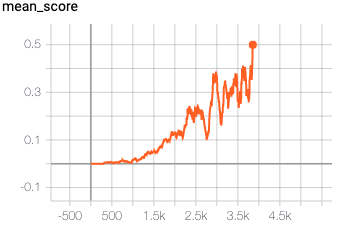

## Report

#### Learning Algorithm

- I choosed to update target network directly within for-loop, due to code-reuse, not original MADDPG, which does this after for-loop, see: https://arxiv.org/abs/1706.02275

- new hyperparameter init_weights_variance, hidden_layer_1, hidden_layer_2, sigma, theta
- I used seed=2, change to seed=0
- I did not use a new sample for every agent?!
- I added epsilon to the noise before, here without
- need to remove __pycache__/ every run?
- depends on init vars, every run is different?
- do soft update at every agents loop, I had it after the agents loop before
- in model: +actions size moved to input layer, dont know why my version not works
- in model: lim = 1. / np.sqrt(fan_in) for init other layers
- in model: use relu instead of leaky_relu
- in my learn: actor: I did actor_local(all_states) for ALL agents and summed the result up: correct: only for the agent in the loop
- AND not (all_states), but for every single state one call, array result up
- use their replay buffer
- user their noise
- I used weight_decay=0.0001 for the critic, deleted
- select_actions: I used to return an array, here return zeros
- did not use huber loss like mentioned in MADDPG paper

HELP from udacity: https://knowledge.udacity.com/questions/303326 -> no epsiodes ~5_000
HELP: https://github.com/and-buk/Udacity-DRLND/blob/master/p_collaboration_and_competition/Report.md hyperparameters
- https://knowledge.udacity.com/questions/261898

I have choosen a MADDPG[2] to solve this environment. In this project, the MADDPG consists of 2 agents and a total of 4 neural networks per agent, divided into Actor (local version and target version) and Critic (local version and target version). Each agent's actor is able to predict the actions in continuous space. In this algorithm, the actor deterministically predicts one action, the action which maximizes the reward for the agent. For every of the 2 agents, the next actions are predicted separately and added into a list. Every of the 2 agent's critic gets this list (the list is caluclated new for every critic) as input to get the Q-value. This calculation is done for every local and target critic of both agents. The critic's loss is calculated with the local and target Q-value. This is done for each agent separately.
For every agent, the actor's loss is calculated separately, too. For the actor's loss, the next actions for the local actor are predicted and used within the agent's local critic to estimate a reward. This estimated reward represents the loss, which then can be optimized by gradient descent. As gradient descent decreases the loss, the estimated reward is prefixed with a negative sign, to use gradient descent as gradient ascent. To enable exploration, a noise is added to every predicted action for every agent. All of the target networks are copies from their local networks and not trained by backpropagation. Instead, their weights are updated with a very small portion of their related local weights every timestep. All agents share one replay buffer.

# I used the Ornstein-Uhlenbeck implementation from OpenAI-Baselines[5].

#I used the ReplayBuffer implementation from OpenAI-Baselines[6].

#### Model

- observation space is is 3*8:
# Vector Observation space size (per agent): 8
# Number of stacked Vector Observation: 3
to track motion

I use the DDPG architecture from the DDPG paper[2] section 7 `Experiment Details`.
The Actor gets the observation space as input, which is mapped to a dimension of `400` in the first hidden layer. The second hidden layer maps from size `400` to size `300` and the last layer maps to the action size. The last layer uses `tanh` as activation function.

The critic gets the observation space as input, which is mapped to size `400` in the first hidden layer. 
To the second hidden layer, the actions are added in the input and then mapped to a dimension of `300`. The last layer maps from size `300` to the output dimension of `1`, 

In both, the actor and the critic, the weights and bias of the last layer are initialized by a uniform distribution within `(-3*10e-3, 3*10e-3)`.

I have choosen `leaky relu` as activation function in the hidden layers in both, the actor and the critic.

This model architecture is used for the local and the target network.

#### Hyperparameter

**buffer_size**
Configures the maximum size of the replay buffer, older values will be discarded. I started with a size of `10e6`, like described in the DDPG paper. As this takes a while to fill with one agent, I decreased the buffer size to `1e6`, like used in the udacity example in [1]. This also took a while, therefore I decreased to `1e5`. After reading the advice for this project in Udacity Knowledge Base[4] to better use a large buffer, I set value to `1e6`.

**sample_batch_size**
Configures how much samples at each learning step should be pulled from the replay buffer, actual value `64` identical to the size in the DDPG paper [2].

**gamma**
The factor how much future rewards should be noted in the valuation of the current action, actual value `0.99` like in the DDPG paper [2].

**tau**
Configures the ratio of how much the target weights in the target network should be updated with actual weights during update process, actual value `1e-3` like in the DDPG paper [2].

**actor_learning_rate**
The learning rate of the actors' optimizer, actual value `10e-4` like in the DDPG paper [2].

**critic_learning_rate**
The learning rate of the critic's optimizer, actual value `10e-3` like in the DDPG paper [2].

**update_every**
Controls how often the weights of the target network should be updated, actual value `10`, which means every 10th timestep. I added this functionality after reading the advice to this project in the Udacity Knowledge Base[4] to do soft-update every 10 or 20 timesteps.

**weight_decay for critic optimizer**
In the DDPG paper[2] the optimizer for the critic has a weight_decay of `10e-2`, after playing around with the other hyperparameters and not getting some progress, I had a look into [3] and changed the weight_decay to `0.0001`.

**noise**
In the DDPG paper[2] to enable exploration, a noise generated with an Ornstein-Uhlenbeck process is added to the selected action. The Noise is configured with θ = 0.15 and σ = 0.2.

**epsilon**
After reading the advice in the Udacity Knowledge Base[4] for this project to implement anything that reduces noise over time, I added epsilon as a factor for the noise.

    epsilon_start:
    Configures the epsilon used to reduce noise over time at start of each episode. Actual value is `0.1`.

    epsilon_decay_rate:
    Configures how much the epsilon should decay after each timestep, actual value `0.995`.

    epsilon_max_decay_to:
    Configures a minimum value the epsilon should have, regardless the decay rate. Actual value `0.01`

#### Rewards

The agent reaches a mean reward of 0.5 over the last 100 episodes after episode #todo.

#### Ideas for Future work

- First of all, maybe switch to multiple agents like used in the MADDPG-Lab-Implementation from Udacity could speed-up training due to getting experience in parallel and therefore chances are to have more experiences in the buffer which contain reward > 0 made by multiple agents through exploration in early stage of training. Learning from samples with positive reward is good as reward should be maximized.

- In the notes to the `Benchmark Implementation` from the udacity project, a solution which uses self-play is used. This can alternatively implemented to solve this task.

- The use of a prioritized experience replay buffer, in which sampling focus lies on values with high error, could make the agent reach the goal faster. Due to the values have high error, there is a lot to learn from this values. Also sparse experiences have the chance to be sampled more often.

- In the MADDPG-paper, a huber loss is used. As described in [7], this is more robust to outliers and could improve training here.

[1] https://github.com/udacity/deep-reinforcement-learning/tree/master/ddpg-bipedal

[2] https://arxiv.org/abs/1706.02275

[3] https://github.com/udacity/deep-reinforcement-learning/blob/master/ddpg-bipedal/ddpg_agent.py#L18

[4] https://knowledge.udacity.com/questions/277763

[5] https://github.com/openai/baselines/blob/master/baselines/ddpg/noise.py#L49

[6] https://github.com/openai/baselines/blob/master/baselines/deepq/replay_buffer.py#L7

[7]